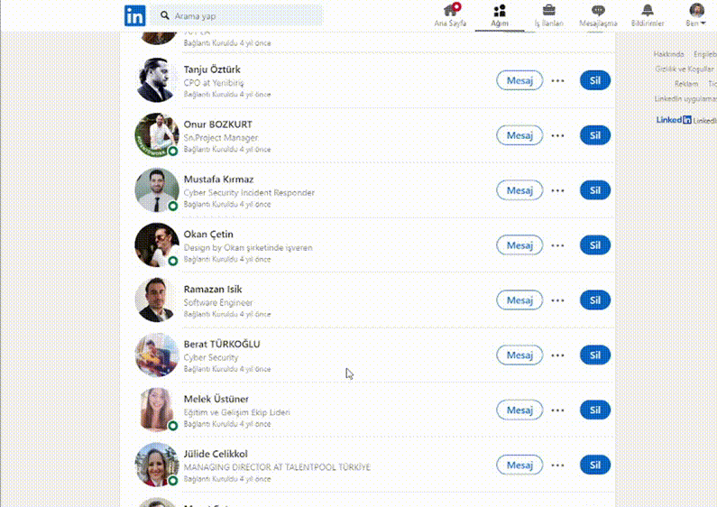

# LinkedIn One Click Connection Remover Script

Remove a LinkedIn Connection with a single click using this userscript for Tampermonkey.

## Installation

1. Make sure you have a userscript manager installed in your browser, such as Tampermonkey.
2. Click [here](https://raw.githubusercontent.com/MehmetHuseyinDelipalta/LinkedIn-Connection-Remover/main/script.js) to open the raw version of the script.
3. Tampermonkey will prompt you to install the script.

## Description

This userscript enhances the LinkedIn experience by providing a quick way to remove a connection with just one click. It adds a "Sil" (Remove) button to the LinkedIn connection dropdown for easy access.

## Author

[Mehmet Hüseyin Delipalta](https://github.com/mehmethuseyindelipalta)

## Usage

1. Log in to your LinkedIn account.
2. Visit the profile of the connection you want to remove.
3. Click on the three dots (ellipsis) next to the "Message" button on the connection's profile card.
4. Click on the "Sil" (Remove) button to remove the connection.

### Demo :video_camera:

## Features

- Single-click connection removal.
- Removes the need to go through multiple confirmation steps.
- Adds a shortcut button for quick access.

## Contribution

Feel free to contribute to the development of this userscript. Create issues, submit pull requests, and help make it even better!
